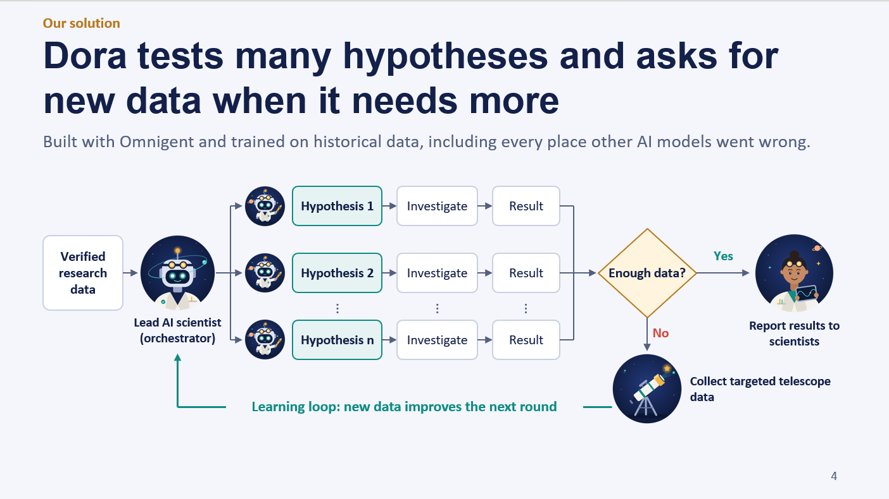

# Exoplanet discovery loop

A multi-agent lab, built on **Omnigent**, that discovers the planets around a star from its radial-velocity data. It proposes competing explanations, tests them, has them reviewed, and requests more telescope time when the data cannot settle the answer.

Built for the Hack-Nation × Databricks "Agentic Scientific Discovery" challenge ([docs/PS.pdf](docs/PS.pdf)) on the [Stargazer](https://github.com/AIPS-UofT/Stargazer) benchmark ([docs/Stargazer.pdf](docs/Stargazer.pdf)).

## The discovery loop



Each task is one star and a set of velocity measurements. The lab must report how many planets orbit it and on what orbits.

1. **Evidence.** The analyst finds which periodic signals in the data are credible.
2. **Hypotheses.** The lead agent registers at least two competing planetary systems. They must differ in a way the data can decide: the number of planets, or which of two look-alike periods is real.
3. **Plan.** The lead records each candidate test with its expected learning and its cost.
4. **Experiments.** Investigators fit the chosen hypotheses in parallel.
5. **Review.** The critic approves or rejects the leading fit.
6. **Decide.** A fixed numerical rule returns one of: conclude, review, refine, or observe.
7. **Observe.** If the data cannot separate the models, the lab takes a campaign of new measurements, refits every candidate, and returns to step 1.

The loop ends when the rule concludes or the budget runs out. Every step is written to a shared research record, which is rendered as a plain-language report.

## Built on Omnigent

Omnigent runs the whole lab. The repo uses four of its features:

| Feature | How the lab uses it |
|---|---|
| **Agent definitions** | Four agents declared in YAML under [agents/v1_lab/](agents/v1_lab/): a lead (PI), an analyst, an investigator and a critic. Each has its own prompt and its own tool list. |
| **Sub-agent dispatch** | The lead sends work with `sys_session_send` and collects replies with `sys_read_inbox`. Investigators on competing hypotheses run at the same time. |
| **MCP tool servers** | Each agent session starts [lab/lab_server.py](lab/lab_server.py) over stdio. Agents never touch the benchmark directly. |
| **Policies** | [lab/policies.py](lab/policies.py) enforces rules the prompts cannot guarantee: no fit is submitted without a critic verdict, and no configuration is submitted twice. |

The lead agent only plans and decides. It has no fitting tools, so it must delegate analysis. The critic has no way to submit, so its review is independent.

[runner/batch.py](runner/batch.py) fills the agent templates for one task ([runner/materialize.py](runner/materialize.py)), then starts one headless `omnigent run` session per task and exports the transcript.

## Technical details

### Shared state

Each sub-agent session starts its own copy of the tool server, so nothing is held in memory. Hypotheses, fits, verdicts, plans, observations and submissions are appended to files in the run directory. The `ledger` tool returns them as one ordered record. [lab/episode.py](lab/episode.py) owns this state and the budgets, and reloads observations across processes after a campaign.

### Tools

| Tool | Purpose |
|---|---|
| `task_summary` | Dataset facts and remaining budget |
| `periodogram` | Signal peaks in the data or in a fit's residuals, with false-alarm probabilities, harmonics and sampling aliases |
| `propose_hypothesis` | Register a candidate system by its starting periods |
| `fit_hypothesis` | Fit orbits for a hypothesis |
| `record_verdict` | The critic's approve or reject, with reasons |
| `observe_or_conclude` | Apply the decision rule; schedule observations if needed |
| `submit_fit` | Spend one submission on a reviewed fit |
| `note`, `ledger` | Write to and read the research record |
| `PythonREPL` | Checks the other tools do not cover; benchmark internals are blocked |

### Fitting ([lab/rv.py](lab/rv.py))

- **Signal search.** A generalised Lomb-Scargle periodogram. Each peak is tagged with the peaks it is a harmonic of and with its sampling aliases.
- **Orbit fit.** Period, eccentricity and phase of each planet are found by global optimisation. Amplitudes and per-instrument offsets are solved exactly by linear least squares at each step. Periods may move by a set fraction from the hypothesis.
- **Fit report.** RMS against the pass limit, BIC, each planet's detection strength, and flags for a period on its search bound, eccentricity at the 0.8 limit, or two near-equal periods.

Detection strength is `K / σ × sqrt(N / 2)`: the planet's velocity amplitude over the measurement error, scaled by the number of points.

### Decision rule ([lab/decide.py](lab/decide.py))

The rule is numerical. The lead agent is told not to replace it with its own judgment.

**Leader.** The model with the fewest planets that no larger model beats by 10 or more in BIC. Ranking by raw BIC would favour planets that only fit noise.

**Status.** Checks fall in two groups. Problems that more analysis can fix never trigger an observation.

| Status | When | What the lab does |
|---|---|---|
| `needs_review` | The leader has no critic verdict | Dispatch the critic |
| `refine` | Poor fit, leftover signal, optimiser stuck on a bound, or critic rejection | Fit a new hypothesis that addresses it |
| `observe` | The data cannot separate the models or pin down the leader | Take a campaign and refit |
| `conclude` | All checks pass | Submit the leader |
| `unresolved` | Budget spent without a conclusion | Report what is known |

**Thresholds.**

| Constant | Value | Meaning |
|---|---|---|
| `DECISIVE_BIC` | 10 | BIC gap needed to prefer a larger model |
| `RESIDUAL_FAP` | 0.001 | A residual peak below this is an unexplained signal |
| `MIN_STRENGTH` | 5 | Below this a planet is not a secure detection |
| `MAX_PERIOD_OVER_BASELINE` | 1.5 | Beyond this the orbit is poorly covered by the data |
| `SAME_PERIOD` | 0.05 | Fractional difference below which two fits are the same orbit |

### Observing campaigns

A campaign adds up to 10 points, with at most 30 per task. New points are simulated from the task's true planets with white noise and jitter. Every candidate fit is then refitted on the enlarged data, and the tool returns a map from old to new fit ids.

### Budgets

Stargazer allows 3, 5 or 10 submissions for easy, medium and hard tasks. The lab also caps tool calls (40, 60, 80), refit rounds, follow-up points and wall time.

## Layout

| Path | Contents |
|---|---|
| [agents/](agents/) | Omnigent agent definitions |
| [lab/](lab/) | Tool server, fitting, decision rule, policies, episode state, report rendering |
| [runner/](runner/) | Batch runner: one Omnigent session per task |
| [ui/](ui/) | Local web interface for starting and watching runs |
| [experiments/](experiments/) | Task lists and analysis scripts |
| [runs/](runs/) | Recorded runs |
| [tests/](tests/) | Unit tests |
| [third_party/Stargazer](third_party/Stargazer) | The benchmark, as a git submodule |

## Setup

```bash
git clone --recurse-submodules git@github.com:Prad-R/exoplanets.git
cd exoplanets
```

You need a Python environment at `.venv` with Omnigent, the Stargazer package from the submodule, `numpy`, `scipy` and `pytest`. Check Omnigent with `omnigent --version`; it must be signed in to a model provider.

## Run

Agent runs call a paid model. Start with one task.

```bash
# One task
.venv/bin/python runner/batch.py --arm v1_lab --tasks seed96_diff3 --out runs/v1_obs

# A task list, capped at $20
.venv/bin/python runner/batch.py --arm v1_lab --tasks experiments/demo_tasks.txt \
    --out runs/v1_obs --workers 1 --max-cost 20
```

`--tasks` takes a file with one task id per line, or comma-separated ids. Finished tasks are skipped on rerun.

| Option | Default | Meaning |
|---|---|---|
| `--workers` | 2 | Tasks run in parallel |
| `--max-cost` | none | Stop starting tasks once this many dollars are spent |
| `--max-observations` | 30 | Total follow-up points per task |
| `--obs-per-campaign` | 10 | Follow-up points per campaign |
| `--max-compute-rounds` | 4 | Refit rounds per task |
| `--prompt` | empty | Research prompt added before the task brief |
| `--live-logs` | off | Show Omnigent output in the terminal |

Each task writes `runs/<out>/<task>/` with the transcript, the research record and `result.json`.

### Web interface

```bash
.venv/bin/python ui/server.py        # opens http://127.0.0.1:8765
```

### Tests

```bash
.venv/bin/python -m pytest -q tests  # no model calls
```

## Recorded runs

Lab runs are in [runs/v1_obs](runs/v1_obs) and [runs/v1_representative](runs/v1_representative). The lab has not been run on the full benchmark.

## Limits

- Follow-up observations are simulated from the task's true planets. This stands in for a telescope; it is not new data.
- Simulated follow-ups leave out the correlated stellar noise that 40% of synthetic tasks contain.
- A strength of 5 is a low bar for concluding. Orbits usually match the truth only at much higher strength.
